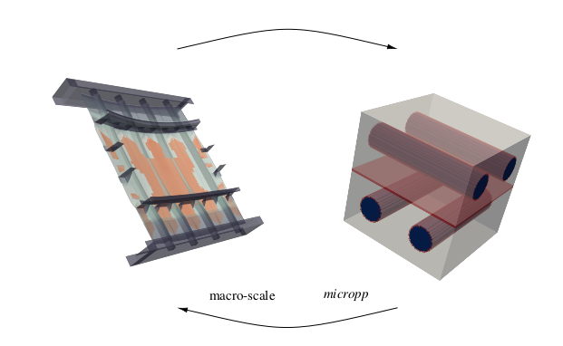
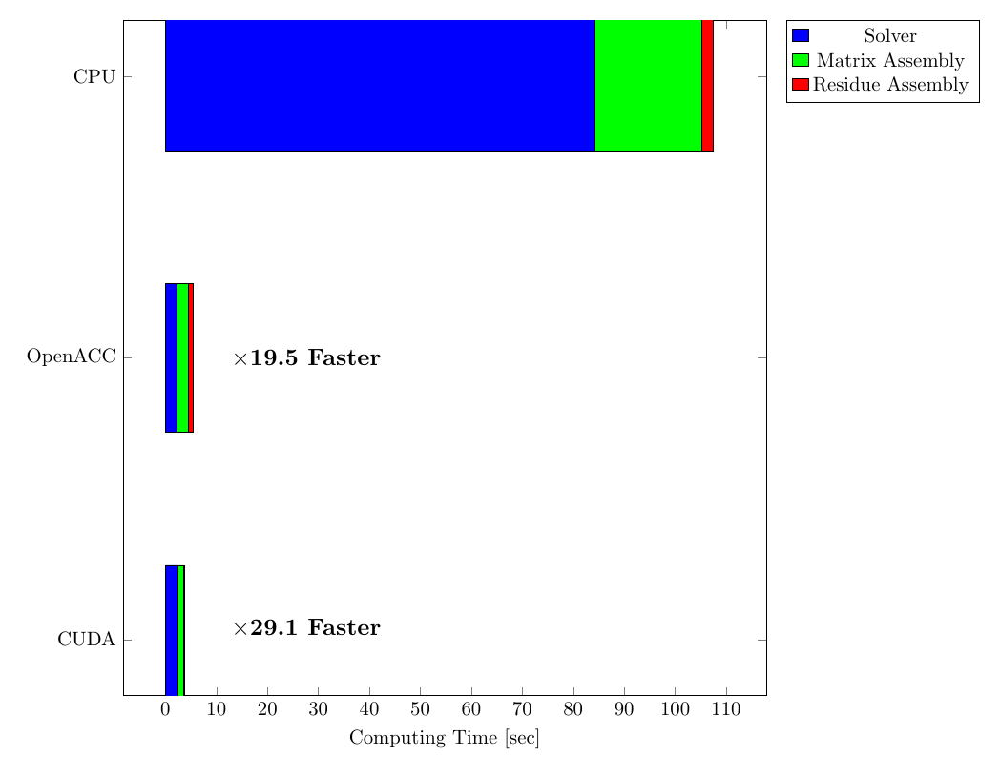
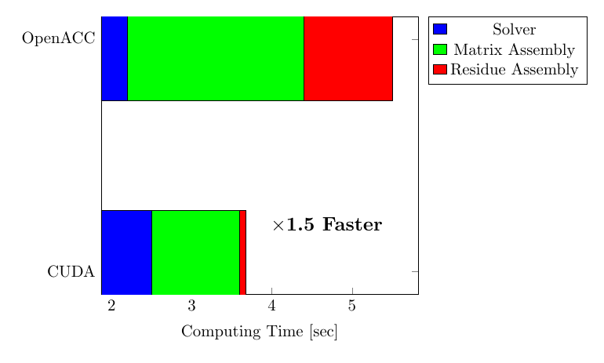

# Micropp

[](https://travis-ci.org/GG1991/Micropp)

High-Perfomance Computing (HPC) 3-D Finite Element Method (FEM) solid
mechanics code to solve micro-scale problems for composite materials.

The code solve the equilibrium equations at Representative Volume
Elements (RVE) to calculate average properties (stresses and
constitutive tensors) for multi-scale simulations:


The code it is design to be coupled with macro-scale code that
operate with the FEM and preferably are MPI-based. Currently the code
has been coupled with the FEM multi-physics code Alya and has achieved
to solve the largest simulation in the field (10 K elements at the
macro-scale and 100^3 elements at the micro-scale):



The code has been ported to GPUs to accelerate the calculation of the
micro-scale problems.

# Characteristics

1. Works with 3-D structured FE elements problems
2. OpenACC and CUDA (under development in `cuda` branch)
   acceleration support for GPUs
3. OpenMP support for multi-core CPUs
4. Solver: Diagonal Preconditioned Conjugate Gradients (DPCG)
5. Around 10 micro-structures patterns and 3 material laws (elastic,
   damage and plastic)
6. No external dependencies
7. Native instrumentation to measure performance
8. C and Fortran Wrappers

# Performance CPU vs. GPUs

The peformance using the hybrid CPU/GPU execution in notably better
than CPU-only:



For hybrid CPU/GPU the parallelization with CUDA has proven better
perfomance than OpenACC:



Currently CUDA acceleration only works with some parts of the code and
has not been completely integrated.

Build steps with CMake:
-----------------------

1. Clone the repository
2. cd cloned directory
3. mkdir build (can be also build+anything)
4. cd build
5. cmake .. (important the 2 points)
6. make

This will build the examples and the library in debug mode. CMake does
not touch the original sources and you can have many build directories
with different options if you want.

To build the optimized version:

```bash
cmake -DCMAKE_BUILD_TYPE=Release ..
```

and the debug version:

```bash
cmake -DCMAKE_BUILD_TYPE=Debug ..
```

Other possible options are:

1. `ENABLE_CUDA=[ON|OFF]` compiles with CUDA
2. `ENABLE_OPENACC=[ON|OFF]` compiles with OpenACC (only supported by some compilers such as PGI)
3. `ENABLE_OPENMP=[ON|OFF]` compiles with OpenMP for multi-core CPUs
4. `ENABLE_TIMER=[ON|OFF]` activate the native instrumentation for measuring times
