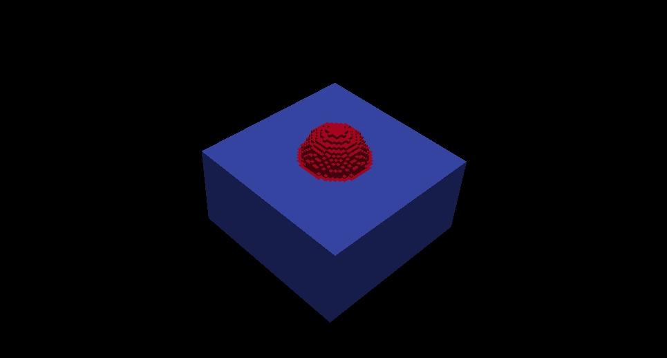
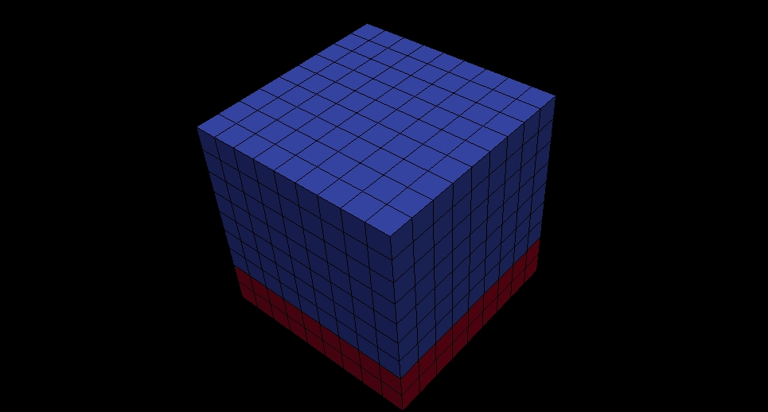
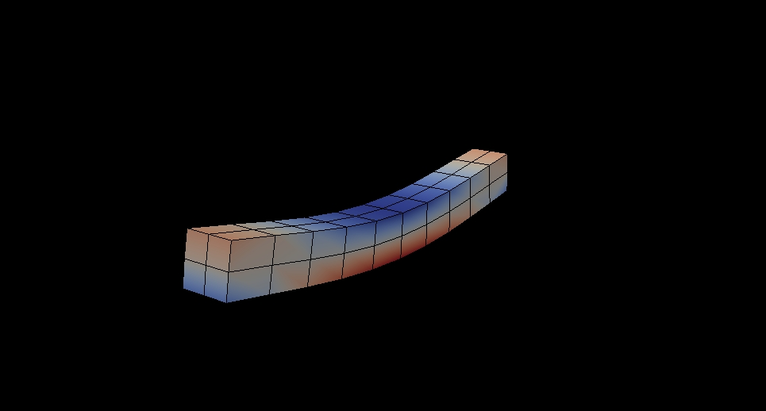
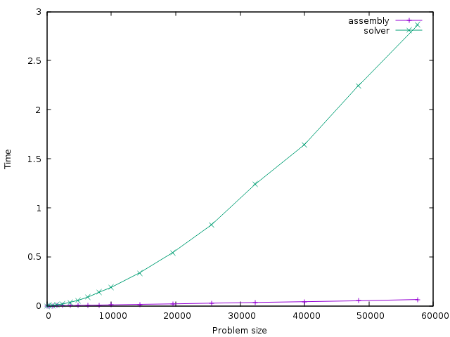

## Micropp

Code to localize and average strain and stress over a micro structure.

# Characteristics

1. Works with structured grids 2D or 3D
2. Plastic non-linear material model for testing the memory storage and efficiency.
3. Supports boundary condition : uniform strains (Pure Dirichlet)
4. Runs sequentially.
5. Own ELL matrix routines with CG iterative solver (diagonal pre-conditioner).
6. Different kinds of micro-structures

# Main Characteristics

`MicroPP` can simulate different kind of microstructures in 2D and 3D 





`MicroPP` has been coupled with high-performance codes such as [Alya](http://bsccase02.bsc.es/alya) developed at the
Barcelona Supercomputing center ([BSC](https://www.bsc.es/)) to performed **FE2** calculations.



`MicroPP` has its own ELL matrix format routines optimized for the structured grid geometries that it has to manage.
This allows to reach a really good performance in the assembly stage of the matrix.
The relation between the assembly time and the solving time can be below than 1% depending on the problem size.



# Compile

## Library and test examples
Requirements : `boost` (for some examples only), `g++` and `make`.

Debug version

```bash
make <test_1...8>
```

Optimized version

```bash
make <test_1...8> OPT=1
```

## Library only

Requirements : `g++` and `make`.

Debug version

```bash
make lib
```

Optimized version

```bash
make lib OPT=1
```

Build steps with CMake:
-----------------------

1. Clone the repository 
2. cd cloned directory
3. mkdir build (can be also build+anything)
4. cd build
5. cmake .. (important the 2 points)
6. make

This will build the examples and the library in debug mode. CMake does not touch
the original sources and you can have many build directories with different
options if you want.

To build the optimized version proceed like before but change step 5 for:

```bash
cmake -DCMAKE\_BUILD\_TYPE=Release ..
```

Other possible options are: Debug, Release, RelWithDebInfo, MinSizeRel. Read CMake documentation for more information.

An option **TIMER** was added to insert time measure instrumentation for the execution. You can enable the option during cmake configuration time.

```bash
cmake -DTIMER=on ..
```

The new option is independent of Debug or release mode. But remember that any 


